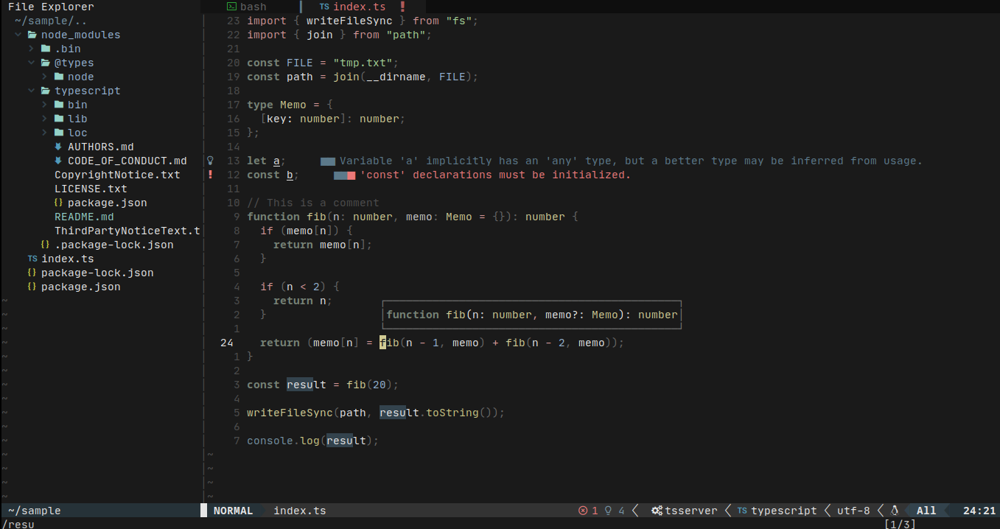

### Prospector

##### Neovim colorscheme

---



#### Requirements
- Neovim >= 0.5
- [Treesitter](https://github.com/nvim-treesitter/nvim-treesitter)

#### Installation
```
use 'toppair/prospector.nvim'
```

#### Usage
```
require('prospector').setup()
```

#### Configuration
```
{
  terminal_colors = true,
  underline_diagnostics = true
}
```

#### Plugin support
- [Bufferline](https://github.com/akinsho/bufferline.nvim)
- [Lualine](https://github.com/hoob3rt/lualine.nvim)
- [NvimTree](https://github.com/kyazdani42/nvim-tree.lua)
- [Telescope](https://github.com/nvim-telescope/telescope.nvim)

---
