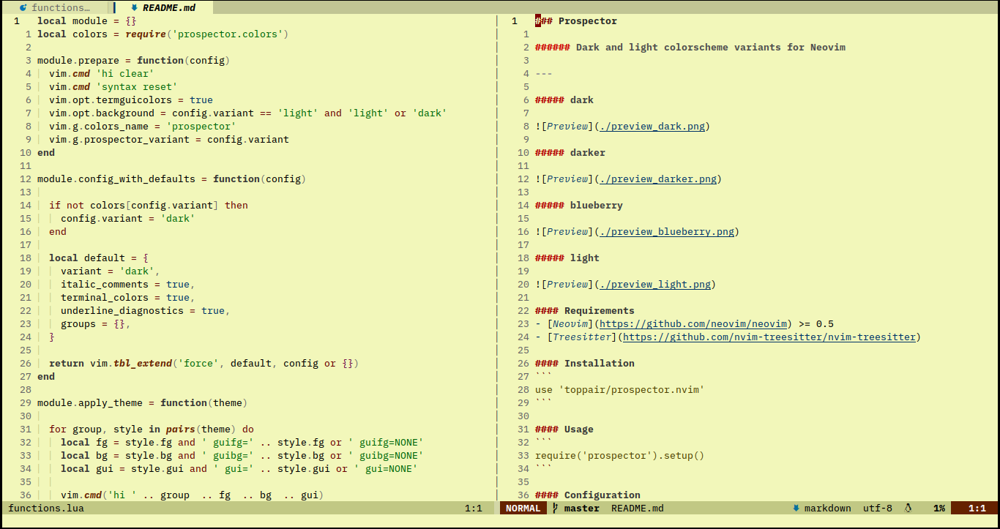

### Prospector

###### Dark and light colorscheme for Neovim

---

##### Dark


##### Light



#### Requirements
- Neovim >= 0.5
- [Treesitter](https://github.com/nvim-treesitter/nvim-treesitter)

#### Installation
```
use 'toppair/prospector.nvim'
```

#### Usage
```
require('prospector').setup()
```

#### Configuration
default:
```
{
  variant = 'dark',
  italic_comments = true,
  terminal_colors = true,
  underline_diagnostics = true,
  groups = {}
}
```

##### linking / altering groups
```
{
  groups = {
    TSComment = 'String'                              -- link TSComment group to String group
    TSFunction = { fg = '#ffffff', gui = 'italic' }   -- make function names white and italic
  }
}
```

#### Plugin support
- [Bufferline](https://github.com/akinsho/bufferline.nvim)
- [Cmp](https://github.com/hrsh7th/nvim-cmp)
- [Dashboard](https://github.com/glepnir/dashboard-nvim)
- [Lualine](https://github.com/hoob3rt/lualine.nvim)
- [Marks](https://github.com/chentau/marks.nvim)
- [NvimTree](https://github.com/kyazdani42/nvim-tree.lua)
- [Telescope](https://github.com/nvim-telescope/telescope.nvim)
- [TreesitterContext](https://github.com/romgrk/nvim-treesitter-context)

---
